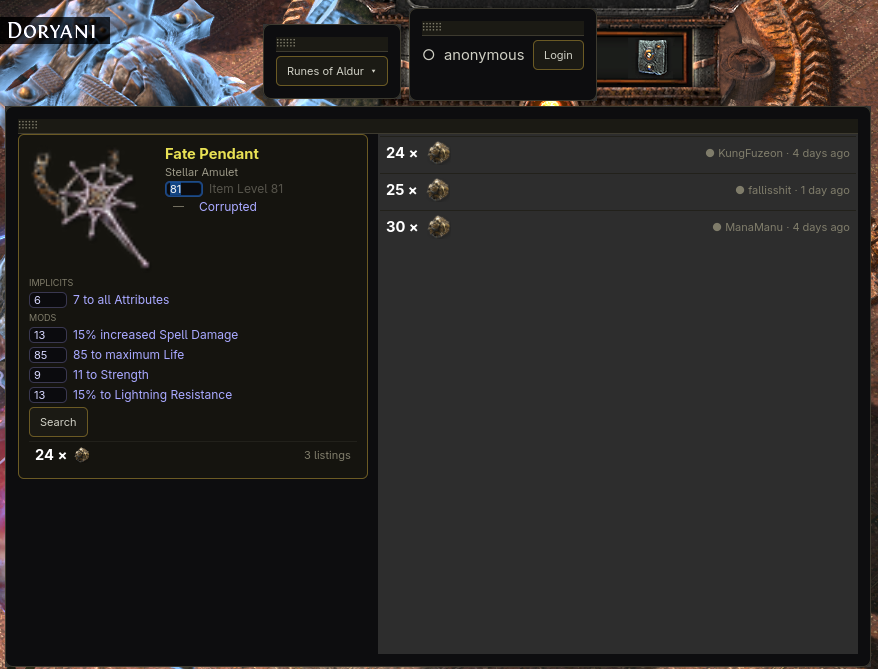
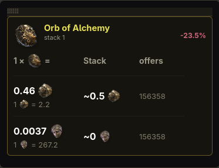
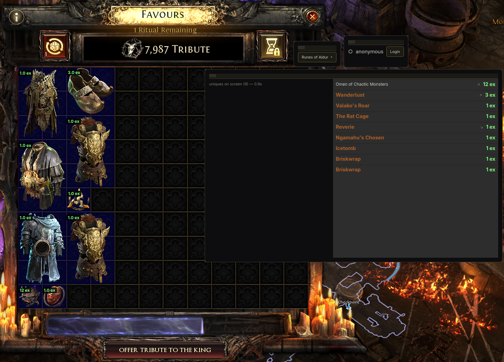

# Waystone

Path of Exile 2 price-checking overlay, built Wayland-first for Arch Linux + Hyprland.

Exists because existing tools (Exiled Exchange 2, Sidekick) are broken on Wayland — Electron refuses the portal GlobalShortcuts API, so this project goes around Electron entirely.

## Install (Arch)

From the [AUR](https://aur.archlinux.org/packages/waystone):

```sh
yay -S waystone
```

Then run `waystone`. Requires Hyprland (hotkeys are bound dynamically via `hyprctl` while the PoE2 window exists).

## Features

- **Price check** (`Alt+Z`): hover an item in-game, press the hotkey, get a layer-shell panel with trade listings or currency exchange rates. Press again to re-check the hovered item, `Esc` to close.
- **Unique scan** (`Alt+X`): scans the screen for unique items and shows click-through price badges, highlighting anything worth more than a configurable exalted threshold.
- Currency and material prices come from [poe2scout](https://poe2scout.com), with the official trade2 bulk exchange as fallback. Gear listings use trade2 search/fetch, rate-limited.

## Screenshots

**Item price check** — hover + `Alt+Z`: parsed mods on the left, live listings on the right; league selector and login sit on top.



**Currency lookup** — exchange rates against exalted/divine, stack value, and price trend from poe2scout.



**Unique scan** — `Alt+X` scans the screen (here a Ritual window) and prices every unique it recognizes.



## Architecture

Two processes connected by a Unix socket (JSON-lines protocol):

- **poed** (Python) — everything Wayland/desktop: GTK4 + gtk4-layer-shell overlay, global hotkeys via xdg-desktop-portal GlobalShortcuts, clipboard (`wl-paste`), Ctrl+C injection into the game window (`xdotool`, PoE2 runs under Proton/XWayland), brain process lifecycle.
- **brain** (Node/TypeScript) — everything PoE: item-text parser, trade-query builder, trade2 + bulk API clients, rate limiter, cache. Parser and game data vendored from [Exiled Exchange 2](https://github.com/Kvan7/Exiled-Exchange-2) (MIT) under `brain/vendor/ee2/`.

**Flow:** - Hotkey → portal activation → focused-window guard → inject Ctrl+C → read clipboard → send to brain → parsed item priced via trade APIs → result rendered in the overlay panel.

## AI disclosure

This project was built with the help of AI (Claude). Side projects like this wouldn't be possible for me without it.

If that's a concern for you, the source is right here — read through it, issues and PRs are welcome.

## Development setup

Arch packages:

```
python-gobject python-opencv python-numpy gtk4 gtk4-layer-shell xdg-desktop-portal-hyprland wl-clipboard xdotool nodejs
```

Python ≥ 3.12.

```sh
cd brain && npm install
```

Run the daemon:

```sh
cd poed && python -m poed
```

On first run a commented config is written to `~/.config/waystone/config.toml` with all defaults — edit it to set your league, account name, or an optional `poesessid` session cookie, then restart.

## Testing

- Brain: `cd brain && npm test` (vitest, golden clipboard samples → expected parse + query JSON).
- poed/protocol: `cd poed && pytest` (round-trips against a live brain child process).

## License

[AGPL-3.0-or-later](LICENSE), except `brain/vendor/ee2/` — brain parser and game data vendored from Exiled Exchange 2 under MIT (see `brain/vendor/ee2/PROVENANCE.md`).
